# asciigen

Turns a picture into characters — by matching each glyph's **shape** against that patch of
the image, not by mapping brightness to a `.:-=+*#%@` ramp.

Renders to the terminal, to `.ans`/`.txt`, or back into a PNG.

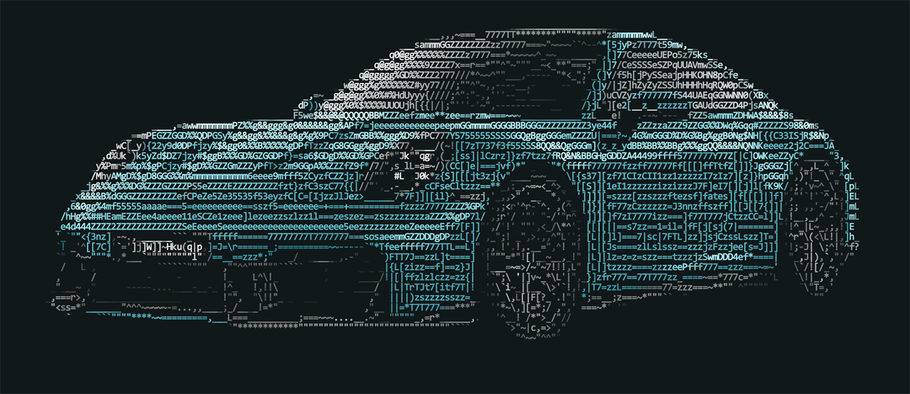

```sh
asciigen photo.jpg                                        # straight to the terminal
asciigen photo.jpg --preset wallpaper-center --out ./out  # a desktop wallpaper
```

---

## Why it looks different

Most ASCII converters compute one number per cell — average brightness — and index into an
ordered string. Everything about *where* the ink sits inside that cell is thrown away before
a character is ever chosen.

`asciigen` rasterises the font, then scores every glyph against the actual pixels:

| Algorithm | How it picks |
|---|---|
| **`structure`** *(default)* | Edge **direction** and ink **placement**, as two separate terms on two different grids |
| **`bitmask`** | Per-pixel correlation of glyph ink against the cell, optionally solving two colours per cell |
| **`ramp`** | The classic brightness ramp, for when you want that |

The two-grid split in `structure` is the part that matters. Direction is pooled coarsely,
because a stroke's angle is a property of a *region*; placement is compared per-pixel,
because surface shading is only distinguishable that finely. They want opposite things, and
giving each the grid it wants is what makes edges clean **and** flat surfaces smooth.

On top of that: ordered dithering with a contrast gate, edge detection, colour grading,
palette mapping, and synthesised bold.

---

## Gallery

Every image below is `asciigen` output. The full set — 65 renders, one folder per source,
every preset — is produced by [`assets/images/generate-showcase.ps1`](assets/images) into
`output/showcase/`; these are the picks.

| **Block elements** · `--preset blocks`<br>Two colours solved per cell over `U+2580`–`U+259F`. Highest fidelity, least like text. | **Default** · `--preset photo`<br>The same source through the `structure` selector, for comparison. |
|---|---|
| 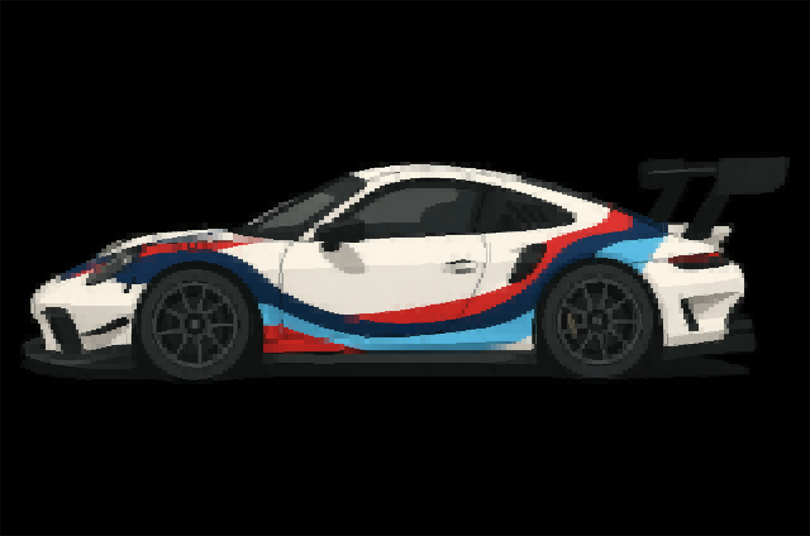 | 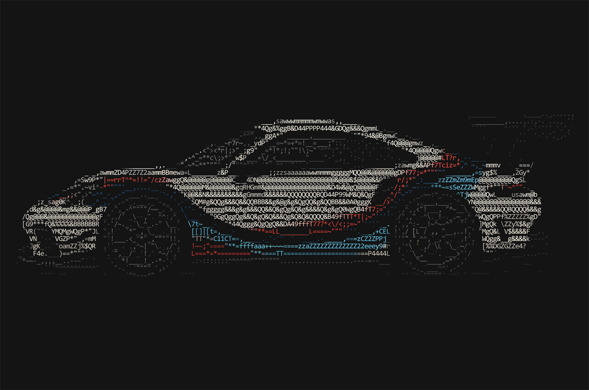 |

| **Braille** · `--preset braille`<br>`U+2800`–`U+28FF`, eight dots per character. | **Line art** · `--preset lineart`<br>Edges into directional glyphs, no colour. | **Plain** · `--preset plain`<br>Characters only, nothing clever. |
|---|---|---|
| 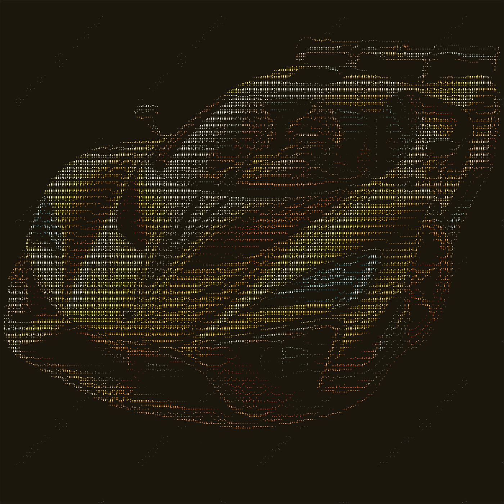 | 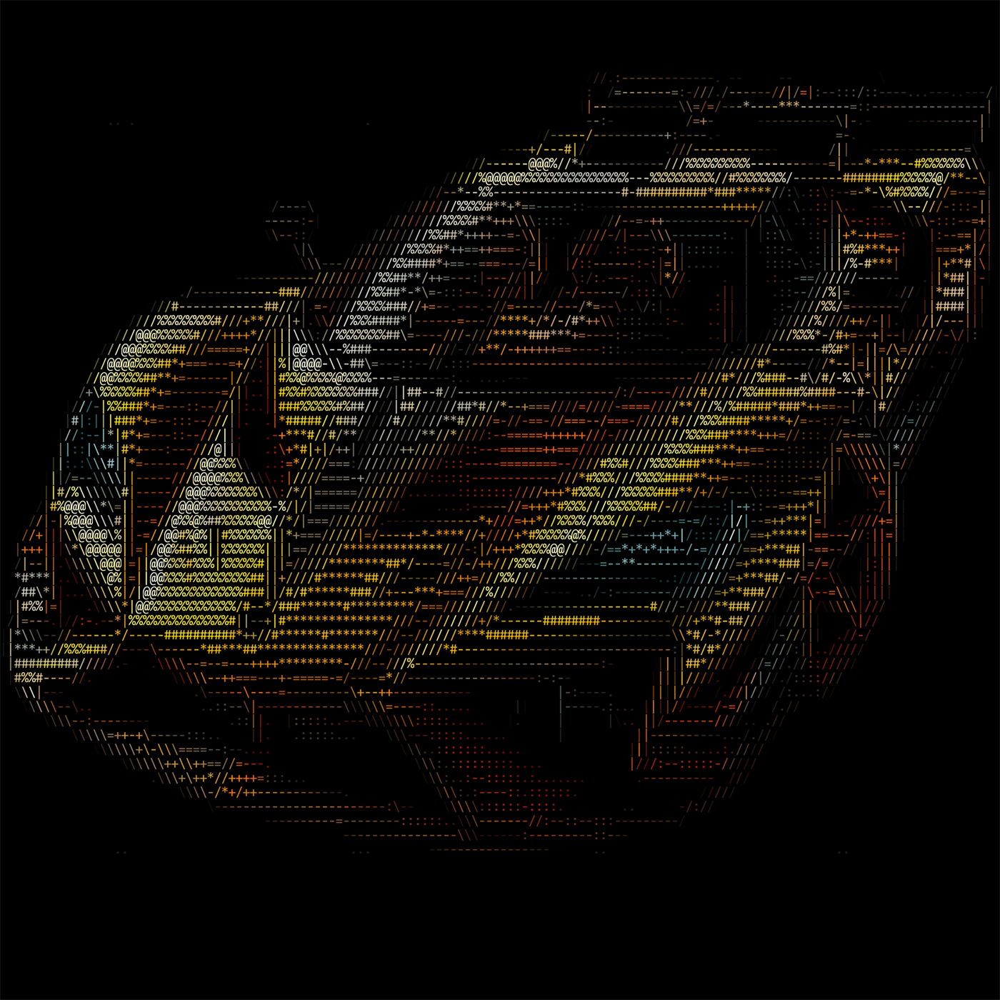 | 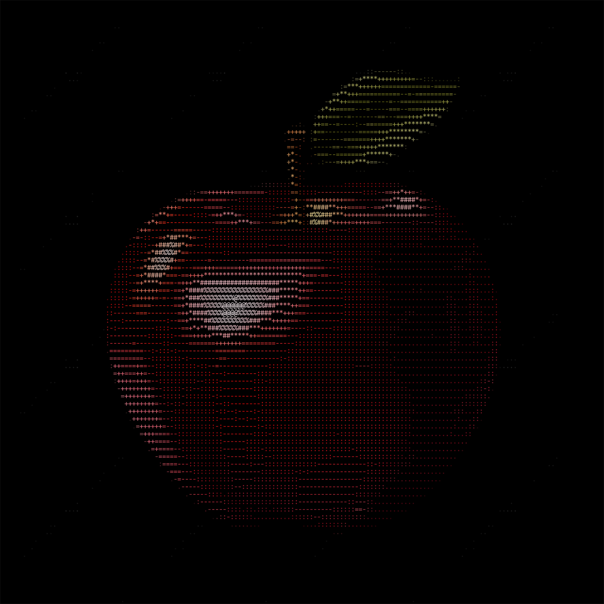 |

| **Cover** · `--preset wallpaper-cover`<br>Fills the screen edge to edge. | **Center** · `--preset wallpaper-center`<br>Floated inside a canvas *grown* to 16:9 — nothing resampled, nothing cropped. |
|---|---|
| 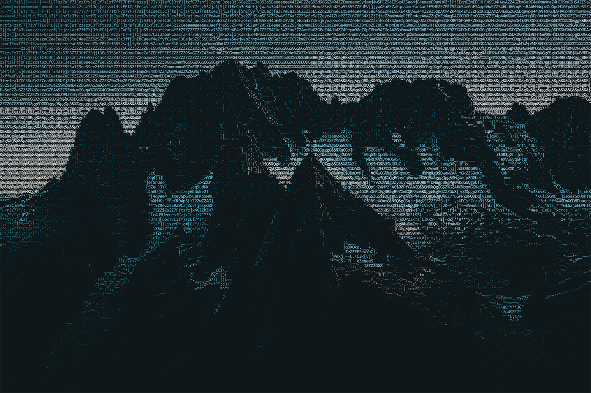 | 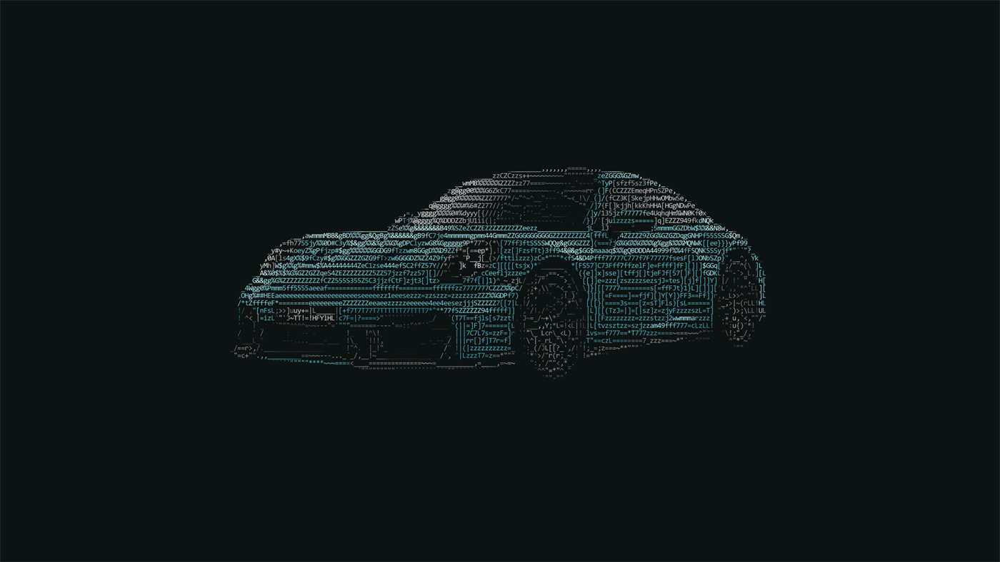 |

| **Bold braille** · `--font-bold`<br>Thickens the outline before rasterising, so a regular face renders bold. | **Bold photo** · `--font-bold`<br>No second font file needed. |
|---|---|
| 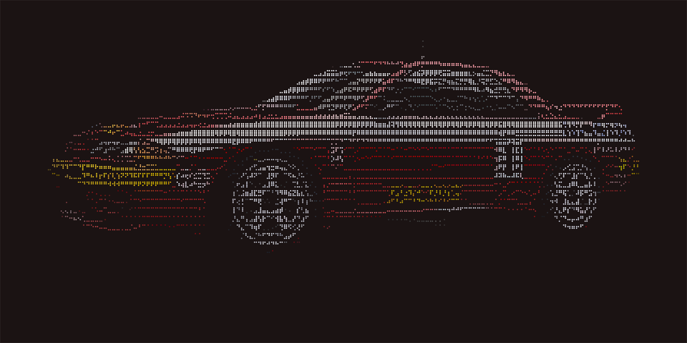 |  |

| **Nord** · `--preset nord`<br>Cell colours snapped to a palette by perceived distance. | **Gruvbox** · `--preset gruvbox` |
|---|---|
| 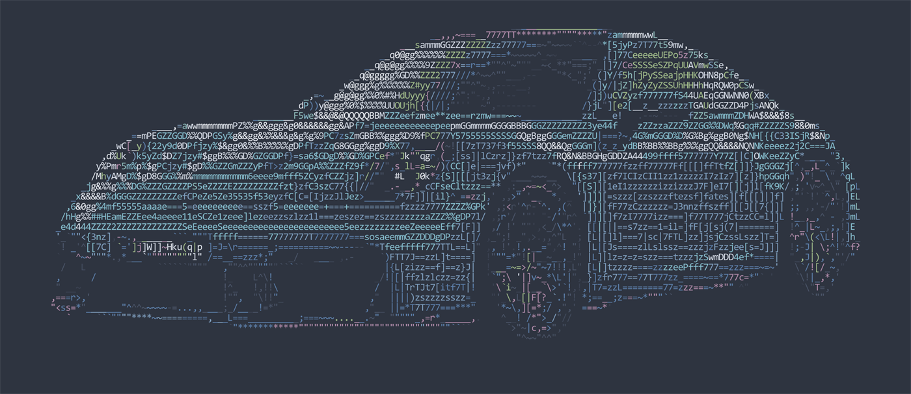 | 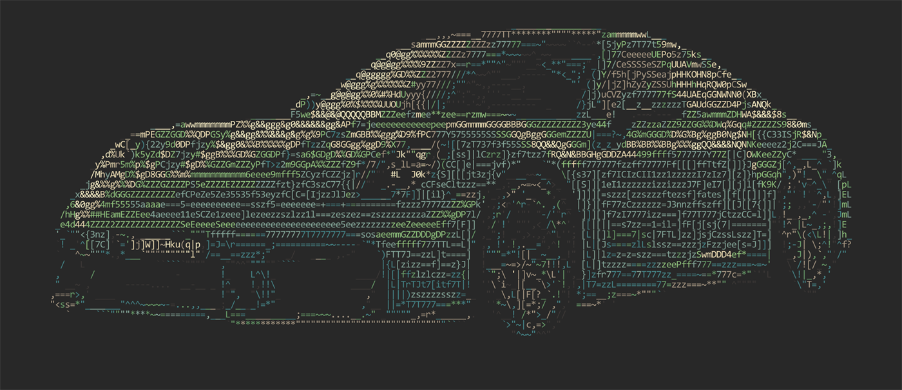 |

---

## Building

CMake ≥ 3.21, Ninja, a C++20 compiler. FreeType is a submodule; `stb` is vendored.

```sh
git clone --recurse-submodules <repo>
cd asciigen

cmake --preset release
cmake --build build/release
```

Cloned without submodules? `git submodule update --init --recursive`.

### Installing

```sh
cmake --build --preset install
```

Goes to `%LOCALAPPDATA%\Programs\asciigen` on Windows — no admin needed — or wherever
`CMAKE_INSTALL_PREFIX` points. Add `<prefix>/bin` to `PATH` once and `asciigen` works
anywhere.

Nothing installs during a normal build; `--preset install` is the only thing that does it.

### Fonts

No font ships with the project. The default is whichever monospace face your OS already has
— Consolas on Windows, Menlo on macOS, DejaVu Sans Mono on Linux — from a per-OS candidate
list in `app/CMakeLists.txt`. Override with `--font-path`.

`blocks` and `braille` need a face that actually carries those Unicode ranges. Cascadia Mono
and DejaVu Sans Mono do; Consolas does not.

Cells always render at a **1:2** aspect whatever the font, so a proportional face will look
wrong. That's a deliberate trade for never breaking the character grid.

---

## Documentation

```
asciigen --help              everything, grouped
asciigen --help <topic>      one group in depth
```

Topics: `input` `source` `font` `charset` `algo` `grid` `dither` `edge` `backdrop` `output`
`presets` `sizing`.

Those pages are plain text in **[`assets/help/`](assets/help/)** — readable there without
building anything. Adding a topic means adding a file; there is no code to change.

**[`inputs.md`](inputs.md)** is the full option reference: every flag, every default, the
sizing rules, and an honest list of known gaps.

### Presets

| Preset | What it is |
|---|---|
| `photo` | The tuned look — auto-levels, sharpen, gamma lift, vibrance, auto backdrop |
| `wallpaper-center` | `photo`, floated at 60% in a 16:9 canvas grown around it |
| `wallpaper-cover` | `photo`, edge to edge at a tall grid |
| `terminal` | `photo`, aimed at the screen |
| `lineart` | Outlines only, no colour |
| `blocks` | Two colours per cell over the block-element charset |
| `braille` | Maximum sub-cell detail — 8 dots per character |
| `plain` | Characters only, nothing clever |
| `gruvbox` / `nord` | `photo` snapped to a palette |

Anything you pass explicitly beats the preset, on either side of it.

### Output

Printing to the terminal is the default. Writing a file is always explicit.

```sh
asciigen photo.jpg --out art.png --out art.ans --out art.txt   # all three, one conversion
asciigen photo.jpg --out ./gallery                             # -> ./gallery/photo.png
```

Format comes from the extension. A **folder** means "put it here, named after the input".

### Sizing

Three sizes, easy to confuse:

| | Controlled by |
|---|---|
| How many characters | `--grid-width` / `--grid-height` |
| Pixels per character | `--font-render-size` |
| Final picture size | `--image-width` / `--image-height` / `--image-aspect` |

Picture size wins — ask for 1920×1080 and everything upstream bends. To keep the render at
full resolution and only reshape the canvas, use `--image-aspect 16:9`: it only ever *grows*
the picture, never crops and never resamples.

`--image-scale`, `--image-margin` and `--image-align` place the art inside the canvas —
useful for a wallpaper needing a clear corner for desktop icons:

```sh
asciigen photo.jpg --preset wallpaper-center --image-align bottom-right \
                   --image-margin 80 --out ./out
```

`--help sizing` has the full rules.

---

## Layout

```
asciigen/     the engine — no CLI, no argv, usable as a library
  core/       Image, CellBuffer, Charset, Color
  bitmap/     the selectors: Ramp, Bitmask, Structure
  dithering/  ordered dithering + the contrast gate
  edges/      Scharr detection and directional overlay
  filters/    source adjustments and cell colour grading
  font/       FreeType rasterisation, glyph atlas
  output/     ANSI and image renderers
  quality/    SSIM/RMSE reconstruction metric
app/          the CLI — parse, dispatch, run
assets/help/  one text file per help topic
```

The engine knows nothing about the command line. `app/` is a parser and a dispatcher; every
stage it calls already exists as a library function.

---

## Third-party

- [FreeType](https://freetype.org/) — submodule, FTL / GPLv2
- [`stb_image`, `stb_image_write`, `stb_image_resize`](https://github.com/nothings/stb) —
  vendored in `lib/stb`, public domain / MIT

No fonts are redistributed. `assets/images/` is gitignored — drop your own pictures there;
nothing depends on any particular file being present.

Showcase images are downscaled copies, kept small so the repository stays small. The script
renders everything at full size into `output/` (gitignored) and copies only the README picks
across — re-run it with `-ShowcaseWidth 0` to commit them at full resolution instead.
